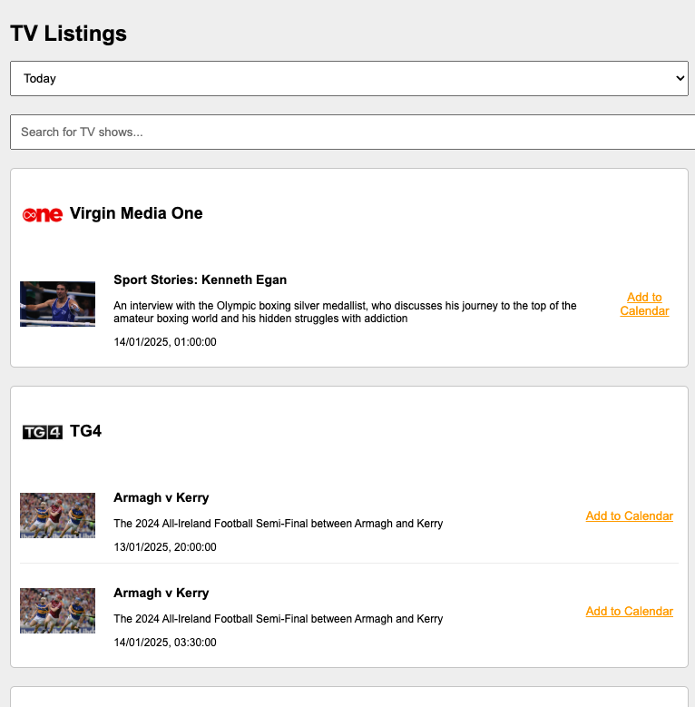

# entertainment-ie-chrome-calendar
Chrome extension that when clicked will fetch the entertainment.ie listings
and display them with a link that can be used to add the event to your calendar.

Entertainment.ie only returns 5 at a time making it difficult to find events.

Also requires a server to be running, this is due to cors restrictions.
```node server.mjs```

### To have the extension load on mac startup.

Create a plist file like the following
```xml
<?xml version="1.0" encoding="UTF-8"?>
<!DOCTYPE plist PUBLIC "-//Apple//DTD PLIST 1.0//EN" "http://www.apple.com/DTDs/PropertyList-1.0.dtd">
<plist version="1.0">
<dict>
  <key>Label</key>
  <string>com.yourusername.nodeserver</string>
  <key>ProgramArguments</key>
  <array>
    <string>/opt/homebrew/bin/node</string> <!-- Path to your Node.js executable -->
    <string>/Users/sheamus.ohalloran/learningworkspace/entertainment-ie-chrome-calendar/node-server/server.mjs</string> <!-- Path to your server -->
  </array>
  <key>RunAtLoad</key>
  <true/>
  <key>KeepAlive</key>
  <true/>
  <key>WorkingDirectory</key>
  <string>/Users/sheamus.ohalloran/learningworkspace/entertainment-ie-chrome-calendar/node-server/</string> <!-- Directory where your server should run -->
  <key>StandardErrorPath</key>
  <string>/tmp/nodeserver.err</string> <!-- Path for error logging -->
  <key>StandardOutPath</key>
  <string>/tmp/nodeserver.out</string> <!-- Path for output logging -->
</dict>
</plist>
```
Then check the file and schedule it run with something like the following
```
plutil ~/Library/LaunchAgents/com.ohallors.nodeserver.plist
launchctl load ~/Library/LaunchAgents/com.ohallors.nodeserver.plist
```
